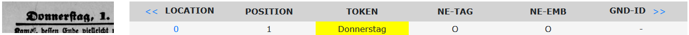

# User Guide
#### version 0.1

### 1. Introduction
[neath](https://github.com/qurator-spk/neath) is a simple, browser-based tool for editing and annotating text with named entities to produce a corpus for training/testing/evaluation. It can be used to add or correct named entity BIO-tags in a TSV file and to correct the token text or tokenization (e.g. due to OCR/segmentation errors). 

[neath](https://github.com/qurator-spk/neath) is developed at the [Berlin State Library](http://staatsbibliothek-berlin.de/) for data annotation in the context of the [SoNAR-IDH](https://sonar.fh-potsdam.de/) project and the [QURATOR](https://qurator.ai/) project.

### 2. User Guide
#### Technical Requirements 
[neath](https://github.com/qurator-spk/neath) runs locally as a pure HTML+JavaScript webpage in your web browser. No software needs to be installed, but JavaScript has to be enabled in the browser. Any fairly recent browser should work, but only Chrome and Firefox are tested.
#### Data format   
The data format is based on the format used in the [GermEval2014 Named Entity Recognition Shared Task](https://sites.google.com/site/germeval2014ner/data). Text is encoded as one token per line, with name spans encoded in the BIO-scheme, provided as tab-separated values:
* the first column contains either a `#`, which signals the source the sentence is cited from, or 
* the token position within the sentence ``>=1``
* sentence boundaries are indicated by ``0``
* the second column contains the token ``text`` 
* outer entity spans are encoded in the third column ``NE-TAG``
* embedded entity spans are encoded in the fourth column ``NE-EMB`` 

Example (simple):
```tsv
No.	TOKEN	NE-TAG	NE-EMB
# https://example.url
1	Donnerstag	O	O
2	,	O	O
3	1	O	O	
4	.	O	O	
5	Januar	O	O	
6	.	O	O		
0		O	O
1	Berliner	B-ORG	B-LOC	
2	Tageblatt	I-ORG	O	
3	.	O	O		
0		O	O
1	Nr	O	O	
2	.	O	O		
3	1	O	O	
4	.	O	O	
0		O	O
1	Seite	O	O
2	3	O	O
```

For our purposes we extend this format by adding
* a fifth column for an ``ID`` for the outer ``NE-TAG`` from an authority file (in this case, the [GND](https://www.dnb.de/EN/Professionell/Standardisierung/GND/gnd_node.html) is used) 
* column six for use as a variable ``url_id`` (see [Image Support](https://github.com/qurator-spk/neath/blob/master/docs/User_Guide.md#image-support) for further details)
* finally, columns 7+ are used for storing ``left,right,top,bottom`` pixel coordinates for facsimile snippets 

Example (full):
```tsv
No.	TOKEN	NE-TAG	NE-EMB	GND-ID	url_id	left,right,top,bottom
# https://example.url/iiif/left,right,top,bottom/full/0/default.jpg
1	Donnerstag	O	O	-	0	174,352,358,390
2	,	O	O	-	0	174,352,358,390	
3	1	O	O	-	0	367,392,361,381
4	.	O	O	-	0	370,397,352,379
5	Januar	O	O	-	0	406,518,358,386
6	.	O	O	-	0	406,518,358,386	
0
1	Berliner	B-ORG	B-LOC	1086206452	0	816,984,358,388
2	Tageblatt	I-ORG	O	1086206452	0	1005,1208,360,387
3	.	O	O	-	0	1005,1208,360,387
0
1	Nr	O	O	-	0	1237,1288,360,382
2	.	O	O	-	0	1237,1288,360,382
3	1	O	O	-	0	1304,1326,361,381
4	.	O	O	-	0	1304,1326,361,381
0
1	Seite	O	O	-	0	1837,1926,361,392
2	3	O	O	-	0	1939,1967,364,385
```

#### Data preparation  
We also provide some [Python tools](https://github.com/qurator-spk/neath/tree/master/tools) that help with data wrangling.
#### Navigation
* use mouse wheel to scroll up and down
* use navigation `<<` and `>>` to move faster
#### Image Support
Provided facsimile images are available online via the [iiif.io](https://iiif.io/) Image API, [neath](https://github.com/qurator-spk/neath) supports the embedding of facsimile snippets into its interface to help with data annotation and correction. 
This further requires that OCR with word segmentation is applied to the image to determine bounding boxes for tokens. 

The iiif-image-url contained in the source ``#`` can then be used as a replacement for ``url_id`` in combination with the token bounding boxes as ``left,right,top,bottom`` to obtain the facsimile snippet url and display the image in the leftmost column. Clicking on the facsimile snippet opens up a new tab with a larger context.




#### Tagging
* adding a tag
* removing a tag
* changing a tag
#### Text correction
* editing the token text
#### Tokenization correction
* merging two tokens
* splitting a token
* sentence boundaries
#### Saving progress
[neath](https://github.com/qurator-spk/neath) runs fully locally in the browser. Therefore it can not automatically save any changes you made to disk. You have to use the `Save Changes` button in order to so manually from time to time.

If your browser automatically saves all downloads to your `Downloads` folder, you might want to configure it so that it instead prompts you where to save.

Configuration option in Firefox:


Configuration option in Chrome:


### 3. FAQ
