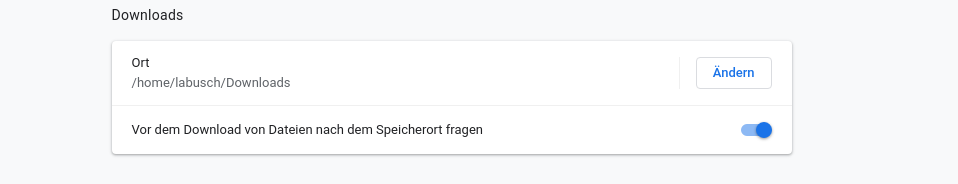

# User & Annotation Guide
version 0.1

### 1. Introduction
* Basic outline - what is this and what can I use it for
* SoNAR-IDH project (https://sonar.fh-potsdam.de/)
* QURATOR project (https://qurator.ai/)

### 2. User Guide
#### Technical Requirements 
* Javascript enabled, Browser-Compatibility?
* Data input format (https://sites.google.com/site/germeval2014ner/data)
* Data preparation ([Python tools](https://github.com/cneud/ner.edith/tree/master/tools))
#### Overview of Editor Features
  * Navigation
    * use mouse wheel to scroll up and down
    * use navigation `<<` and `>>` to move faster
    * show image snippet
  * Tagging
    * adding a tag
    * removing a tag
    * changing a tag
  * OCR correction
    * editing the token text
  * Segmentation correction
    * merging two tokens
    * splitting a token
#### Data export/Saving progress
The editor runs fully locally in the browser. Therefore it can not automatically save any changes you made to disk. You have to use the "Save changes" button in order to do that manually from time to time.

If your browser automatically saves all downloads to your "Downloads" folder, you might want to configure it such that it asks you where to save it.

Configuration option in Firefox:

Configuration option in Chrome:

#### FAQ
#### Troubleshooting

### 3. Annotation Guidelines
* https://www.aclweb.org/anthology/W09-3025/
* https://www.aclweb.org/anthology/L14-1251/
